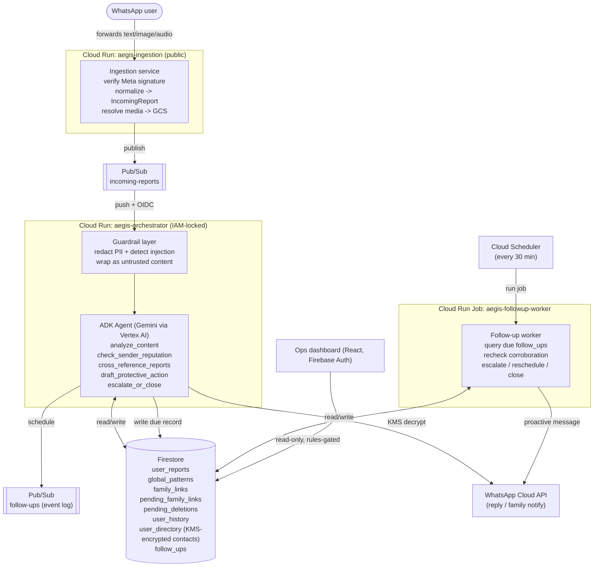

# AEGIS

A WhatsApp-native autonomous agent that investigates forwarded messages,
images, and voice notes for scam patterns, verifies them against a
shared, anonymized threat-pattern database, and takes protective action —
a plain-language explanation, a filing-ready report draft, and (opt-in) a
family notification — while continuing to monitor a case in the
background for hours after the original conversation ended.

Built for Google's "All Things Agentic Hackathon" (Taskmaster track).

## Why this is a real system, not a demo script

Every service here has exactly one job, they only ever talk to each other
through typed Pub/Sub events and typed Firestore documents (never a
direct synchronous call, and never an ad hoc dict), each has its own
least-privilege service account, and every single model call passes
through one guardrail choke point. None of that is decorative — see
[Verification](#verification) for the actual test runs and real `docker
build && docker run` executions that back each claim, and
[docs/prompt-injection-test-log.md](docs/prompt-injection-test-log.md)
for a worked adversarial-input example.

## Architecture



*(Renders natively on GitHub. A polished standalone version is also
available — ask for it as an artifact if you want a presentation-ready
image for the demo video.)*

### Why this shape

- **Single responsibility per service.** Ingestion never touches
  Firestore or Gemini. The orchestrator never talks to WhatsApp's webhook
  directly. The follow-up worker never runs the LLM — a recheck is a
  deterministic Firestore query, not a fresh reasoning session.
- **Guardrails sit in exactly one place.** `shared/guardrails/` is
  imported by the orchestrator and applied both before the very first
  user turn is constructed *and* on every subsequent model call via
  `before_model_callback` — see
  [docs/prompt-injection-test-log.md](docs/prompt-injection-test-log.md).
- **A one-way hash almost broke the product, on purpose, fixed properly.**
  Every Firestore doc keys on `user_id = HMAC(wa_id)` so no collection
  holds a raw phone number — except the entire point of AEGIS is replying
  on WhatsApp. The fix is `user_directory/{user_id} -> KMS-ciphertext
  wa_id`, decrypted only inside `whatsapp_sender.py`, right before the
  Graph API call — never as a tool argument, so a raw number never enters
  the reasoning trace the dashboard shows. See
  `shared/schemas/firestore_models.py::UserDirectoryDoc`.
- **Pub/Sub can't delay delivery, so "monitor" is backed by Firestore.**
  `escalate_or_close`'s "monitor" decision writes a `follow_ups` doc with
  a `not_before` timestamp; the Cloud Run Job, woken by Cloud Scheduler,
  queries `status == pending AND not_before <= now`. That query is what
  makes "runs asynchronously in the background" literally true — a case
  really does get picked back up hours later, not just published-and-forgotten.
- **Tools don't make their own model calls.** `analyze_content` doesn't
  call Gemini a second time — the agent's own (single, guardrail-wrapped)
  model call produces the classification, and the tool is how the agent
  *commits* that classification as typed, persisted, logged state. This
  keeps "every model call goes through the guardrail layer" mechanically
  true rather than aspirational.

## Repo layout

```
aegis/
  services/
    ingestion/            Cloud Run — WhatsApp webhook receiver (FastAPI)
    agent-orchestrator/   Cloud Run — ADK agent + 5 tools (FastAPI, Pub/Sub push)
    followup-worker/      Cloud Run Job — scheduled async re-engagement
  shared/
    schemas/              Pydantic contracts for every event/Firestore doc
    guardrails/           PII redaction + prompt-injection detection
  dashboard/              React + Vite + Tailwind ops console
  infra/
    terraform/            Pub/Sub, Firestore, KMS, IAM, Cloud Run, Scheduler
    firestore.rules        Dashboard read-access rules
  docs/
    prompt-injection-test-log.md
```

## Verification

Everything below was actually executed in this build, not just written
and assumed correct:

| Stage | What was verified | How |
|---|---|---|
| Guardrails | 7/7 tests pass, including a real "ignore previous instructions" attempt and a zero-width-space evasion attempt | `pytest shared/guardrails/tests` |
| Ingestion | 11/11 tests pass: signature verification (valid/tampered/wrong-secret/missing/malformed), webhook payload parsing (text/image/unsupported types), full POST flow with mocked publish, user_id hashing | `pytest services/ingestion/tests` |
| Ingestion (container) | Built and ran the real Docker image; hit `/healthz` and the Meta verification handshake over real HTTP against the running container | `docker build` + `docker run` + `curl` |
| Agent orchestrator | 26/26 tests pass: the full ADK tool-calling loop driven by a scripted fake LLM through all 5 tools + `finish_task`, a "monitor" path publishing a follow-up, proof that `before_model_callback` actually strips PII from the exact text the model receives, all 4 family-link commands, both data-deletion commands, and 3 tests against a **real Firestore emulator** (including a full `purge_user_data` erasure, verified actually gone, not just counted) | `pytest services/agent-orchestrator/tests` |
| Agent orchestrator (container) | Built and ran the real Docker image (all deps incl. `google-adk` installing cleanly); hit `/healthz` | `docker build` + `docker run` + `curl` |
| Follow-up worker | 7/7 tests pass: escalates on new corroboration, closes after max cycles, reschedules with incremented attempt count, skips cases whose status already changed, marks failures without crashing the batch, plus 2 tests against a **real Firestore emulator** | `pytest services/followup-worker/tests` |
| Follow-up worker (container) | Built and ran the real Docker image; failed exactly where expected (missing GCP ADC), proving the code path is correct up to the live-credentials boundary | `docker build` + `docker run` |
| Dashboard | `tsc -b && vite build` succeeds with zero type errors | `npm run build` |
| Infra (Terraform) | `terraform validate` **actually passes** against the real `hashicorp/google` v6.50 provider schema (Terraform CLI installed directly in this sandbox for this), `terraform fmt -check` is clean, and `terraform plan` was run far enough to fail exactly at the expected point (missing GCP credentials) rather than at a config error | `terraform init -backend=false && terraform validate && terraform fmt -check` |
| CI | `.github/workflows/ci.yml` runs all of the above (incl. spinning up the real Firestore emulator) on every push — every shell command in it was run locally first to confirm it actually works, not just written | `.github/workflows/ci.yml` |

**A bug the emulator tests caught for real:** every Firestore write
originally used `model_dump(mode="json")`, which serializes `datetime`
fields to ISO strings. Firestore silently excludes a string-valued field
from a `<=` range query against a datetime query value — no error, zero
results, forever. That would have made `due_follow_ups()` (the entire
async-monitoring mechanism) never find anything in production, and no
mocked unit test would have caught it, since the mocks patch
`firestore_client.due_follow_ups` itself rather than exercising a real
query. Fixed by switching every real Firestore write to
`model_dump(mode="python")` (native datetimes, which the client converts
to proper Firestore Timestamps) and pinned down with
`tests/test_firestore_integration.py` in both `agent-orchestrator` and
`followup-worker`, run against `gcr.io/google.com/cloudsdktool/cloud-sdk:emulators`
— see the module docstring in either file for how to run them yourself.

**A deploy-readiness audit caught 4 more real Terraform bugs that
`validate` alone couldn't** (schema was always valid; these were wiring
gaps): three required APIs (`secretmanager`, `monitoring`,
`billingbudgets`) were never in the enabled-services list despite other
resources depending on them; the orchestrator was missing
`AEGIS_USER_ID_PEPPER` entirely (would have crashed the first `LINK
FAMILY` command in production — masked in unit tests because the test
file sets that env var directly); neither Pub/Sub's nor Cloud Scheduler's
own service agents were granted `roles/iam.serviceAccountTokenCreator` on
the invoker service accounts they mint tokens for, which would have let
`terraform apply` succeed while the push subscription and the scheduled
job silently failed to authenticate forever after — meaning the
orchestrator would never receive a single message and the follow-up
worker would never run, with no error pointing at why; and the billing
budget's project filter needs the numeric project *number*, not the
project ID string. All four fixed and re-validated.

**What is *not* verified here, and needs your GCP project + WhatsApp
credentials to check:** an actual live Gemini/Vertex AI call, an actual
Meta webhook delivering a real message, and `terraform apply` actually
succeeding end-to-end against a real project (validate + a plan that
fails exactly at the credentials boundary is as far as this sandbox can
go). Everything upstream of that boundary is real, working code — that
boundary is a credentials/access problem, not an unfinished-code problem.

## Guardrail design (summary)

See [docs/prompt-injection-test-log.md](docs/prompt-injection-test-log.md)
for the full write-up. In short: `shared/guardrails/pipeline.py` runs PII
redaction (`pii.py`, regex-based: phone/email/URL/card/long-ID/handle,
plus HMAC-based `hash_user_id`) and prompt-injection detection
(`injection.py`, pattern + invisible-unicode + delimiter-spam heuristics)
on every piece of user-forwarded content before it's wrapped in an
explicit `<untrusted_forwarded_content>` delimiter and placed in a model
prompt. The orchestrator's ADK agent additionally sanitizes every
outgoing model request via `before_model_callback` as a second layer, and
logs every tool call's (redacted) arguments and results via
`before_tool_callback`/`after_tool_callback` into both Cloud Logging and
the case's `reasoning_trace` for the dashboard.

## Contact-directory design (why a "hashed everywhere" system can still text you back)

`user_id` is `HMAC-SHA256(wa_id, AEGIS_USER_ID_PEPPER)` everywhere:
Firestore doc keys, logs, the reasoning trace. That's a one-way function
— by design, nothing can turn a `user_id` back into a phone number. But
AEGIS's entire job is replying on WhatsApp, so `IncomingReport` carries
the raw `wa_id` for exactly one hop (ingestion → orchestrator, in memory,
never logged), and the orchestrator registers it once via
`contact_directory.remember_contact`, which encrypts it with **Cloud
KMS** (a real reversible, access-controlled cipher — not a hash) into
`user_directory/{user_id}.encrypted_wa_id`. Decryption happens in exactly
one place, `whatsapp_sender.py`, immediately before the Graph API call —
never inside a tool function, so a raw phone number is structurally
incapable of leaking into a tool-call argument (and therefore into the
logged reasoning trace). The follow-up worker's copy of this module is
decrypt-only (`roles/cloudkms.cryptoKeyDecrypter`, not
`cryptoKeyEncrypterDecrypter`) since it only ever sends proactive
check-ins, never registers a new contact.

## Family-link opt-in

`draft_protective_action` only notifies a family contact if a
`family_links` doc already exists — nothing creates one automatically.
Users opt in (and their contact separately consents) via plain WhatsApp
commands, handled in `family_link_commands.py`:

| Command | Sent by | Effect |
|---|---|---|
| `LINK FAMILY <phone>` | The protected user | Creates a 24h-expiring `pending_family_links` request and messages the target phone asking them to confirm |
| `CONFIRM LINK <code>` | The contact, from their own number | Creates the real `family_links` doc — only valid from the exact number the code was sent to |
| `DECLINE LINK <code>` | The contact | Refuses the request; the requester is told |
| `STOP FAMILY ALERTS` | The contact, anytime | Revokes consent — deactivates every `family_links` doc naming them |

This is **deliberately not an ADK tool** the agent can call. The agent
reasons over adversarial forwarded content; if "link my family member" were
something an LLM could be talked into via text embedded in a scam
message, that's a mechanism for getting AEGIS to message an arbitrary
third party on a scammer's behalf. So the whole flow is matched against
an exact command grammar and handled *before* guardrail sanitization or
any Gemini call — see the module docstring for the full reasoning.

## Data deletion ("forget me")

Same reasoning and pattern as family-link, in `data_deletion_commands.py`:

| Command | Effect |
|---|---|
| `DELETE MY DATA` | Opens a 10-minute confirmation window (`pending_deletions/{user_id}`) |
| `DELETE MY DATA CONFIRM` | Irreversibly erases every `user_reports` doc, `user_history`, the user's own `family_links` entry, deactivates any `family_links` naming them as someone else's contact, and finally their `user_directory` (KMS-encrypted contact) entry |

`global_patterns` is never touched by this — those docs are anonymized
scam-entity fingerprints that never identified the reporting user, so
there's nothing of an individual's to erase there. The confirmation
message is sent *before* `user_directory` is deleted (order matters: once
that's gone, AEGIS has no way left to reach that `user_id`).

## Production hardening beyond the hackathon baseline

Added after the initial build, once "does it work" turned into "is it
safe to point real traffic at":

- **Secrets**: `infra/terraform/secrets.tf` creates Secret Manager
  containers + least-privilege `secretAccessor` IAM per service; Cloud
  Run reads them via `value_source.secret_key_ref`, never a plain env
  var. The five secret *values* are added out-of-band with `gcloud
  secrets versions add` (commands in that file's header) so a secret
  value never touches a `.tfvars` file or Terraform state.
- **Remote state**: `infra/terraform/backend.tf` — a GCS backend with a
  bootstrap script in its header comment (versioned bucket, public access
  stripped).
- **Cost/abuse ceilings**: `max_instance_count` on both Cloud Run
  services (`cloud_run.tf`) and a three-threshold billing budget alert
  (`monitoring.tf`) so a traffic spike or abuse has a hard ceiling on what
  it can cost before a human is paged.
- **Alerting**: `monitoring.tf` — DLQ backlog (which also needed a real
  subscription added in `pubsub.tf`, since a Pub/Sub topic retains
  nothing without one and messages were being silently dropped), Cloud
  Run 5xx rate on both HTTP services, and follow-up worker job-execution
  failures.
- **CI**: `.github/workflows/ci.yml` — every Python/dashboard/Docker/
  Terraform check in the table above, plus a live Firestore emulator, on
  every push.

**Still open, deliberately not built speculatively — say the word and
I'll do any of these next:** Cloud Armor + an external HTTPS load
balancer in front of ingestion for real rate limiting (`max_instance_count`
is a blunt backstop, not the fix); a privacy policy / ToS page (Meta
requires one for app review); WhatsApp Business app review itself
(needed before you can message more than 5 test numbers).

## Spin-up

### 0. Prerequisites

- A GCP project with billing enabled.
- `gcloud` and `terraform` (>=1.5) installed and authenticated
  (`gcloud auth login && gcloud auth application-default login`) — **not
  available in the sandbox this was built in**, so run the steps below
  from your own machine.
- A Meta developer app with the WhatsApp Business Cloud API product
  added, a test/production phone number, and its `access_token`,
  `phone_number_id`, and `app_secret`.
- Node.js 20+ (dashboard) and Docker (building service images).
- Your `gcloud`/Terraform identity needs `roles/billing.costsManager` (or
  broader) **on the billing account itself**, not just the project — the
  `google_billing_budget` resource in `monitoring.tf` manages billing-account-level
  IAM, which is separate from project IAM, and a missing grant here is a
  common `terraform apply` failure point specific to that one resource.
  Find your billing account with `gcloud billing accounts list`.

### 1. Bootstrap remote state and generate secret values

```bash
# Remote Terraform state (see infra/terraform/backend.tf for the full comment):
PROJECT_ID="your-gcp-project-id"
BUCKET="${PROJECT_ID}-aegis-tfstate"
gsutil mb -l us-central1 -b on "gs://${BUCKET}"
gsutil versioning set on "gs://${BUCKET}"
# then edit infra/terraform/backend.tf's `bucket` value to match

openssl rand -hex 32   # -> AEGIS_USER_ID_PEPPER, save it somewhere safe
openssl rand -hex 32   # -> GLOBAL_PATTERN_SALT (must differ from the pepper above)
```

### 2. Build and push the three service images

```bash
cd aegis
export PROJECT_ID=your-gcp-project-id
gcloud artifacts repositories create aegis --repository-format=docker --location=us-central1 || true

for svc in ingestion agent-orchestrator followup-worker; do
  docker build -f services/$svc/Dockerfile -t us-central1-docker.pkg.dev/$PROJECT_ID/aegis/$svc:latest .
  docker push us-central1-docker.pkg.dev/$PROJECT_ID/aegis/$svc:latest
done
```

### 3. Provision infrastructure, then add the secret values

```bash
cd infra/terraform
cp terraform.tfvars.example terraform.tfvars
# edit terraform.tfvars: project_id, meta_phone_number_id,
# media_gcs_bucket_name, alert_notification_email, billing_account_id,
# and the three image_* URLs from step 2.
# (No secret VALUES go in this file -- see the next step.)

terraform init
terraform validate
terraform apply
```

Then add the five secret values Terraform deliberately left empty (this
is what keeps them out of `.tfvars` and state — see `secrets.tf`):

```bash
echo -n "your-meta-app-secret"        | gcloud secrets versions add aegis-meta-app-secret       --data-file=-
echo -n "your-chosen-verify-token"    | gcloud secrets versions add aegis-meta-verify-token      --data-file=-
echo -n "your-meta-access-token"      | gcloud secrets versions add aegis-meta-access-token      --data-file=-
echo -n "$AEGIS_USER_ID_PEPPER"       | gcloud secrets versions add aegis-user-id-pepper          --data-file=-
echo -n "$GLOBAL_PATTERN_SALT"        | gcloud secrets versions add aegis-global-pattern-salt     --data-file=-

# Cloud Run only reads a secret at container start, not live -- an
# existing revision won't pick up a version you just added. Force a new
# revision on the same image for each service that needs it:
gcloud run deploy aegis-ingestion    --region=us-central1 --image=us-central1-docker.pkg.dev/$PROJECT_ID/aegis/ingestion:latest
gcloud run deploy aegis-orchestrator --region=us-central1 --image=us-central1-docker.pkg.dev/$PROJECT_ID/aegis/agent-orchestrator:latest
```

Note the `orchestrator_url` output. Configure your Meta app's webhook to
point at `<ingestion_url>/webhook`, with the verify token you set in
`terraform.tfvars`.

*(Optional hardening, second pass once you have the orchestrator's real
URL: set `pubsub_push_audience` to that URL and `terraform apply` again
so `pubsub_auth.py`'s OIDC audience check is exact rather than
issuer-only. Cloud Run's own IAM invoker binding — already scoped to only
the `aegis-pubsub-invoker` service account — is the primary access
control either way.)*

### 4. Deploy the dashboard

```bash
cd dashboard
cp .env.example .env.local   # fill in Firebase web config for the SAME project
npm install
npm run build
firebase deploy --only hosting,firestore:rules   # or serve dist/ from any static host
```

Add yourself as an allowed signer via Firebase Auth (Google sign-in is
wired by default in `AuthGate.tsx`) — `infra/firestore.rules` requires
`request.auth != null` to read `user_reports`/`global_patterns` and
denies client access to everything else.

### 5. Demo the async follow-up loop

Forward a borderline-suspicious message, let AEGIS respond with
`escalate_or_close(decision="monitor", follow_up_hours=...)`, then either
wait for the real interval or run the job manually to show it firing
early:

```bash
gcloud run jobs execute aegis-followup-worker --region=us-central1
```

Watch `follow_ups` and `user_reports` in the Firestore console (or the
dashboard) change state without any new user action — that's the
"runs asynchronously in the background" requirement, live.

## Environment variables reference

| Service | Var | Notes |
|---|---|---|
| ingestion | `GCP_PROJECT_ID`, `MEDIA_GCS_BUCKET`, `META_APP_SECRET`ⁿ, `META_VERIFY_TOKEN`ⁿ, `META_ACCESS_TOKEN`ⁿ, `AEGIS_USER_ID_PEPPER`ⁿ | `PUBSUB_TOPIC_INCOMING_REPORTS`, `META_GRAPH_API_VERSION` optional (defaulted) |
| agent-orchestrator | `GCP_PROJECT_ID`, `GEMINI_MODEL`, `GOOGLE_GENAI_USE_VERTEXAI=true`, `GOOGLE_CLOUD_PROJECT`, `GOOGLE_CLOUD_LOCATION`, `META_ACCESS_TOKEN`ⁿ, `META_PHONE_NUMBER_ID`, `GLOBAL_PATTERN_SALT`ⁿ, `CONTACT_DIRECTORY_KMS_KEY` | `VERIFY_PUBSUB_PUSH_OIDC=false` for local-only testing |
| followup-worker | `GCP_PROJECT_ID`, `GLOBAL_PATTERN_SALT`ⁿ, `CONTACT_DIRECTORY_KMS_KEY`, `META_ACCESS_TOKEN`ⁿ, `META_PHONE_NUMBER_ID` | `MAX_FOLLOW_UP_CYCLES`, `FOLLOWUP_BATCH_SIZE` optional |
| dashboard | `VITE_FIREBASE_API_KEY`, `VITE_FIREBASE_AUTH_DOMAIN`, `VITE_FIREBASE_PROJECT_ID` | public client config, not secrets |

ⁿ = Secret Manager-backed in the deployed Cloud Run config (`value_source.secret_key_ref`
in `cloud_run.tf`), not a plain env var — set as a local env var only for
local/manual testing outside Cloud Run.

All of `terraform.tfvars` is `.gitignore`'d; only `terraform.tfvars.example` is committed.
The five secret values themselves never appear in `.tfvars`, `terraform.tfvars.example`,
or Terraform state at all — see step 3 of Spin-up and `secrets.tf`.

Terraform also now needs `alert_notification_email`, `billing_account_id`,
and (optionally) `monthly_budget_usd` — see `variables.tf` and
`terraform.tfvars.example`.
# AEGIS
