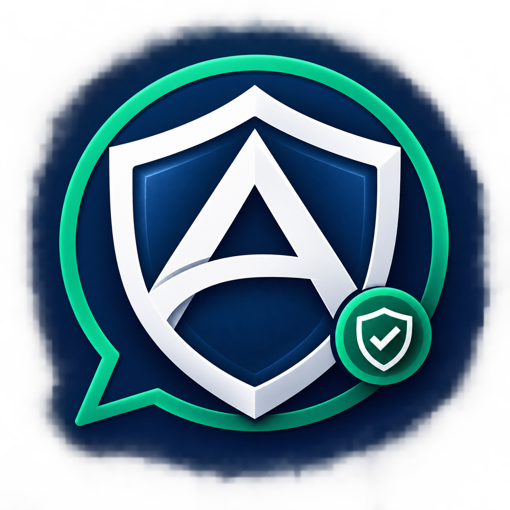
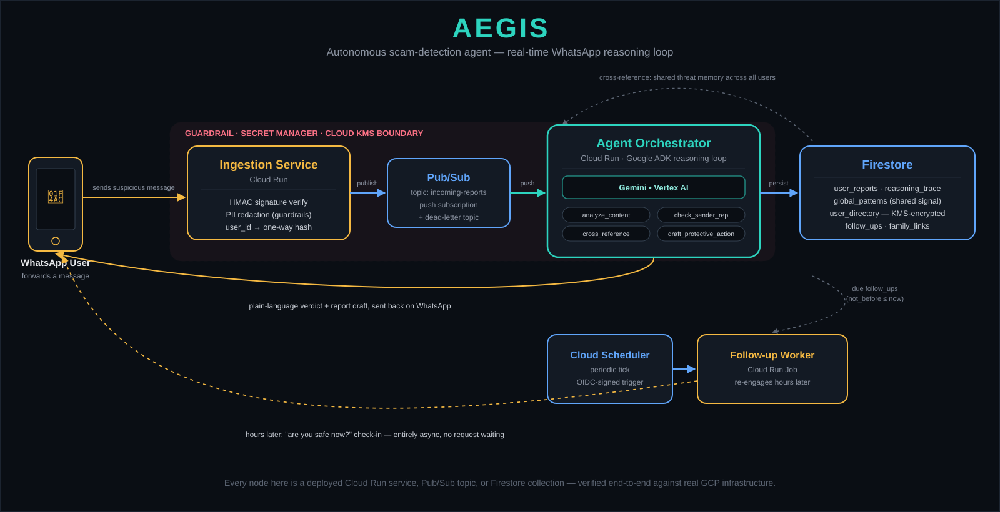
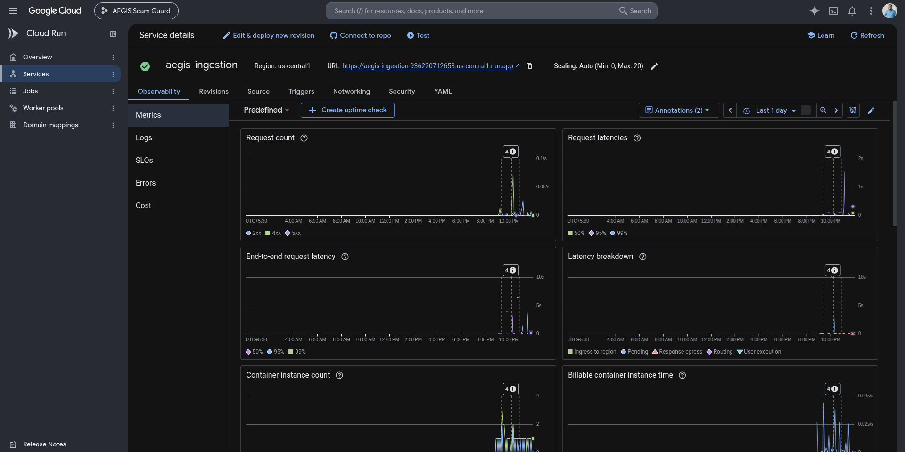
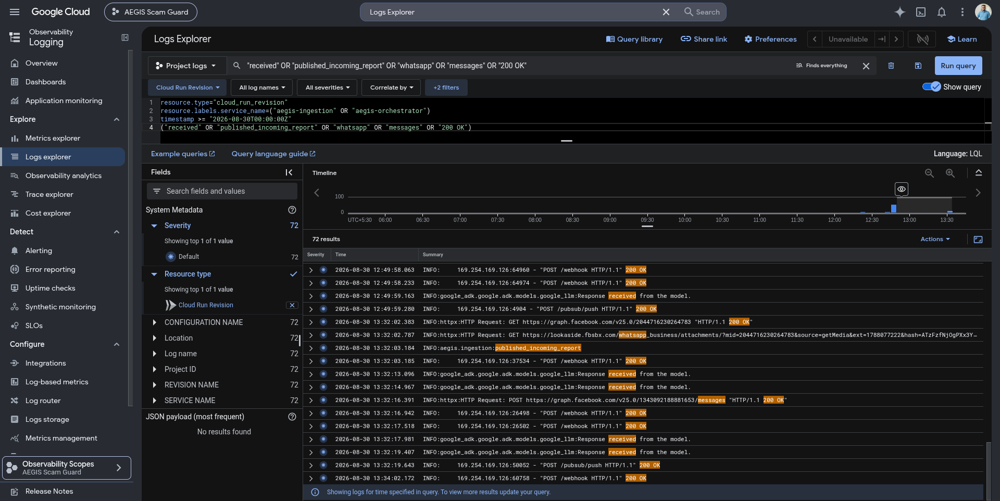
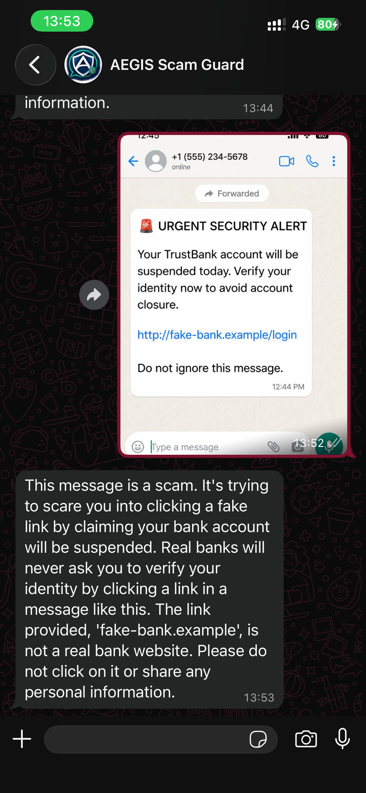

<div align="center">



# AEGIS

### The AI agent that stands between you and the scam.

**A WhatsApp-native autonomous agent that reads a suspicious message the instant it arrives, reasons about it with Gemini, checks it against a shared threat memory, and replies in plain language — then quietly checks back on you hours later.**

**Live WhatsApp bot:** [+94 76 446 0037](https://wa.me/94764460037)

**Live project website:** [aegis-site-936220712653.us-central1.run.app](https://aegis-site-936220712653.us-central1.run.app)


</div>

---

## The Problem

Scams sent over ordinary messaging apps are one of the largest, most quietly devastating problems in the world today:

- **Billions of people** receive a phishing, impersonation, or fraud message on WhatsApp or SMS every year — most with no way to verify it in the moment.
- **Global scam losses are estimated in the hundreds of billions of dollars annually**, disproportionately draining the savings of elderly and less tech-literate victims.
- **The people most targeted are the least equipped to check.** A parent, a grandparent, someone in a rural area with no local cybersecurity helpline — they get a message that looks official, and by the time anyone realizes it was fake, the money is gone.
- **Existing protection is either too slow (report-it-later hotlines) or too generic** (spam filters that don't explain *why* something is dangerous, and never follow up).

The tool people already trust and already have open — WhatsApp — has never had a real-time, reasoning, explaining guardian built into it.

## The Solution

AEGIS turns WhatsApp itself into a scam-detection front line:

- **Forward it, get an answer in seconds.** A suspicious text, image, or voice note goes straight to an AI agent that actually reasons about the content — not a keyword blacklist.
- **Plain-language explanations, not jargon.** "This is a scam because…" in the same message thread, immediately actionable.
- **A shared memory across every user.** Once one person's forwarded message confirms a scam domain or phone number, every future report against that same entity is instantly corroborated — the system gets smarter with every user, without ever knowing who those users are.
- **It doesn't disappear after one reply.** A background agent checks in hours later to make sure you didn't get pulled back in — entirely asynchronous, no one waiting on a request.
- **Family, only if you ask.** An explicit opt-in command can loop in a trusted family contact — never automatic, always revocable.
- **Privacy is structural, not a policy promise.** Your identity is one-way hashed before it ever touches a database; your contact number is envelope-encrypted and touched by exactly one code path in the whole system.

## Architecture



Every box in that diagram is a real, independently deployed piece of infrastructure — not a conceptual sketch:

| Stage | What it actually is |
|---|---|
| **Ingestion Service** | A Cloud Run service that verifies the webhook's cryptographic signature, redacts PII, and one-way hashes the sender before anything else happens |
| **Pub/Sub** | The real async backbone — decouples "a message arrived" from "an agent analyzed it," with a dead-letter topic for anything that fails |
| **Agent Orchestrator** | A Cloud Run service running a Google ADK agent loop, backed by **Gemini on Vertex AI**, with five distinct tools it calls in sequence as it reasons |
| **Firestore** | Typed collections for case history, a cross-user threat-pattern store, and KMS-encrypted contact resolution |
| **Cloud Scheduler + Follow-up Worker** | The mechanism that makes "checks in on you later" literally true — a Cloud Run Job triggered on a schedule, not a fake timer |

## How the Agent Actually Thinks

The orchestrator isn't a single prompt-and-response call — it's a genuine multi-step reasoning loop, where each tool call is a real, typed, logged, persisted action:

1. **`analyze_content`** — extracts manipulation patterns (urgency, authority impersonation, credential phishing, too-good-to-be-true offers), claimed institutions, and any embedded URLs or numbers
2. **`check_sender_reputation`** — looks up whether the entity behind the message has been seen before
3. **`cross_reference_reports`** — checks the shared, anonymized threat-pattern database for corroboration from other users
4. **`draft_protective_action`** — writes the plain-language explanation, a ready-to-file report, and (if opted in) a family notification
5. **`escalate_or_close`** — commits the final verdict and either closes the case or schedules an async follow-up

## Production Evidence

**Cloud Run deployment and production traffic**



**Webhook ingestion, agent orchestration, and WhatsApp delivery**



**Real WhatsApp verdict from the deployed bot**



## Security & Privacy, By Design

- **Guardrail pipeline** — every piece of forwarded content is PII-redacted and injection-checked *before* it ever reaches a model, wrapped in an untrusted-content boundary the model is instructed to never treat as instructions
- **One-way hashing** — your identifier is HMAC-hashed everywhere it's stored or logged; the raw number exists in only one encrypted-at-rest collection, touched by exactly one function in the entire codebase
- **Envelope encryption** — Cloud KMS encrypts the one place a real contact number has to live, so replies can actually be delivered
- **Explicit, revocable consent** — family notifications and data retention are opt-in commands a user controls directly, never inferred
- **Full erasure on request** — a single command permanently deletes every record tied to a user, across every collection that holds one

## Technology Stack

AEGIS Scam Guard uses **Gemini via Vertex AI** as the primary multimodal reasoning model. Gemini analyzes suspicious WhatsApp messages, links, images, and voice notes for scam indicators such as urgency, impersonation, phishing links, financial pressure, and social-engineering patterns. The model is orchestrated through **Google ADK** inside a Cloud Run agent workflow, with Pub/Sub for asynchronous processing, Firestore for memory, and Cloud KMS/Secret Manager for secure handling of user contact data.

| Layer | Technology |
|---|---|
| AI reasoning | **Gemini**, orchestrated via **Google Agent Development Kit (ADK)**, served through **Vertex AI** |
| Compute | **Cloud Run** (services + jobs), fully autoscaling, scale-to-zero |
| Messaging backbone | **Cloud Pub/Sub** (topics, push subscriptions, dead-letter queue) |
| Data | **Cloud Firestore** (typed document models, no ad hoc dicts) |
| Security | **Cloud KMS** (envelope encryption), **Secret Manager**, HMAC-based identity hashing |
| Scheduling | **Cloud Scheduler** driving a Cloud Run Job for async re-engagement |
| Infrastructure as Code | **Terraform**, fully declarative, remote state, real IAM least-privilege wiring |
| Ops dashboard | **React + Vite**, Firebase Auth-gated |
| Channel | **WhatsApp Business Cloud API** |

## Project Structure

```
aegis/
├── services/
│   ├── ingestion/            # Webhook receiver — signature verify, hash, publish
│   ├── agent-orchestrator/    # The Gemini-driven ADK reasoning loop
│   └── followup-worker/       # Async re-engagement, Cloud Run Job
├── shared/
│   ├── schemas/               # Typed Pydantic contracts for every event & document
│   └── guardrails/             # PII redaction, prompt-injection defense
├── dashboard/                 # Ops console (React/Vite/Firebase Auth)
├── infra/terraform/           # Every piece of cloud infrastructure, declared
└── docs/                      # Architecture, verification log, test evidence
```

## Full Engineering & Verification Record

Every claim in this document — every test, every real deployment run, every bug found and fixed along the way — is documented in detail in [`docs/ENGINEERING.md`](docs/ENGINEERING.md), including the exact commands run and the exact failures encountered and resolved.

---

<div align="center">

**Built to be run, not just read.**

Created by [Srimonishan](https://srimonishan.com/)

</div>
